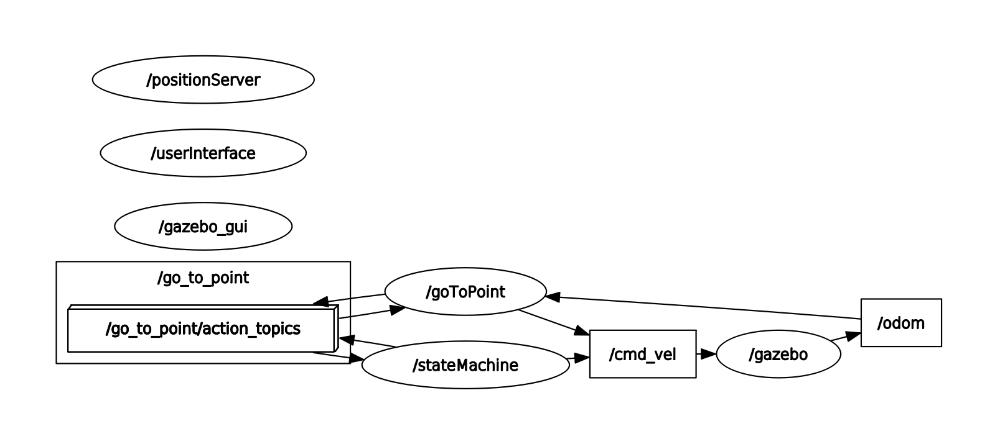

# Research Track II - Assignment 1

Software documentation can be found [here](https://jerin-joy.github.io/ResearchTrack2_Assignment1/)
## Assignment Description

The package contains the nodes and the simulation environment for controlling a mobile robot in the Gazebo simulation environment. 

The user is requested to press '1' to start the movement of the robot and robot will move to a random position. Using the implementation of an action server, the user is able to stop the robot by pressing '0'. Unless the robot is stopped by user, the robot continues to move in a loop to random positions within a given range by generating new targets.

## Package Description

```
├── action
│   └── Move.action             - action file
├── launch 
│   └── sim.launch              - simulation launch file             
├── scripts
│   ├── go_to_point.py          - python script to control the robot
│   └── user_interface.py       - command line interface
├── src
│   ├── position_service.cpp    - random position generation
│   └── state_machine.cpp       - cpp code for FSM
├── srv
│   ├── Command.srv             - user interface service
│   ├── Position.srv            - position service
│   └── RandomPosition.srv      - random position service 
├── urdf
|    └── my_robot.urdf          - mobile robot description
├── CMakeLists.txt              - CMakeLists file
└── package.xml                 - package manifest

6 directories, 12 files
```

## Node Structure



The package consists of four nodes:
- **goToPoint**: The node implements an action server to
drive a robot toward a point in the environment.

- **userInterface**: It implements a simple command interface, which asks the user to start or stop the robot, and calls the service implemented in the FSM.
  
- **positionService**: It implements a random position service which generates a random pose as a response to a request. 
  
- **stateMachine**: The node which implements an action server to start or stop the robot, and calls the other two services to drive the robot. 

## Notebook
The implementation of the interface of the assignment in Jupyter Notebook can be found in the home page as the name [Robot Control.ipynb](Robot%20Control.ipynb) 

## Building and Running

To compile the workspace, navigate to the workspace and enter:
```
catkin_make
```

To launch the node, please run:
```
roslaunch rt2_assignment1 sim.launch
```

